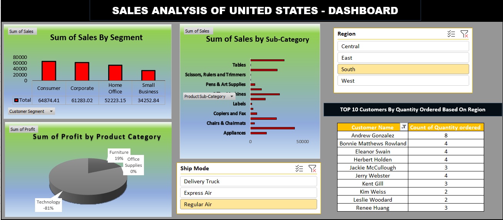

# 📊 Sales Analysis Dashboard (Excel)

An interactive **Sales Analysis Dashboard** built using **Microsoft Excel** to analyze sales performance across different segments, regions, and product categories.

> 🚀 Designed for data-driven decision-making using Excel dashboards.

---

## 📌 Project Overview

This project provides insights into sales trends, customer behavior, and product performance using Excel-based visualization techniques.

---

## ✨ Key Features

- 📊 Sales by Segment  
- 🛍️ Sales by Sub-Category  
- 💰 Profit Analysis  
- 🌍 Region-wise filtering  
- 🚚 Shipping Mode insights  
- 🏆 Top Customers Analysis  

---

## 🧠 Tech Stack

| Category | Tool |
|----------|------|
| Tool     | Microsoft Excel |
| Features | Pivot Tables, Charts, Slicers |

---

## 📂 Project Structure

```
DASHBOARD_Excel/
│
├── dashboard.xlsx
├── sales_dataset.xlsx
└── README.md
```

---

## 📸 Dashboard Preview

<p align="center">
  
</p>

---

## 🚀 How to Use

1. Download the files  
2. Open `dashboard.xlsx` in Excel  
3. Use filters and slicers to explore insights  
4. Dataset is available in `sales_dataset.xlsx`  

---

## 👨‍💻 Author

**Tanmay Khedekar**  
🔗 https://github.com/tanmay302  

---

## 💡 Repository Description

Excel-based Sales Dashboard analyzing regions, segments, and customer insights using pivot tables and charts.
